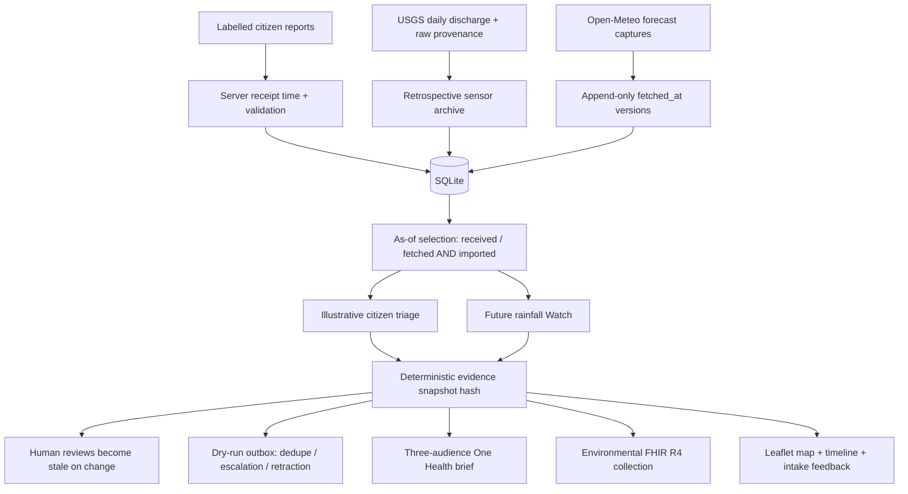

# Decision provenance for One Health

The core runs on Python stdlib, SQLite and a single-process HTTP server. Forecast
provider issue time remains separate from local fetch time and may be unknown.
USGS sensor aggregates never become citizen reports. Reanalysis cannot drive Watch.

Public read-only mode rejects writes. Public interactive mode clones the shared
baseline into bounded, cookie-selected session databases; writes never reach the
shared baseline. Sessions expire after one hour, 50 concurrent sessions maximum,
120 requests per minute per session. This is a bounded demonstration, not an
authenticated operational service or a distributed production architecture.

SQLite insert triggers append a prev_hash chain for new observations, reviews, datasets, forecast captures and outbox emissions. `python -m aquasentinel.audit DATABASE` verifies hashes and recorded rows. Legacy rows are counted honestly as unlogged, not backdated. A database owner can recompute the chain; there is no external trust anchor. Alert retraction is a deterministic as-of projection against the current snapshot, not an externally delivered cancellation.
